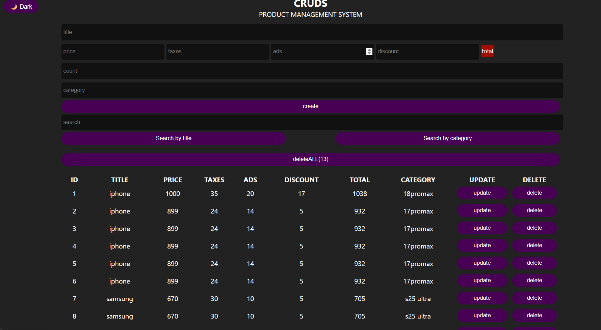
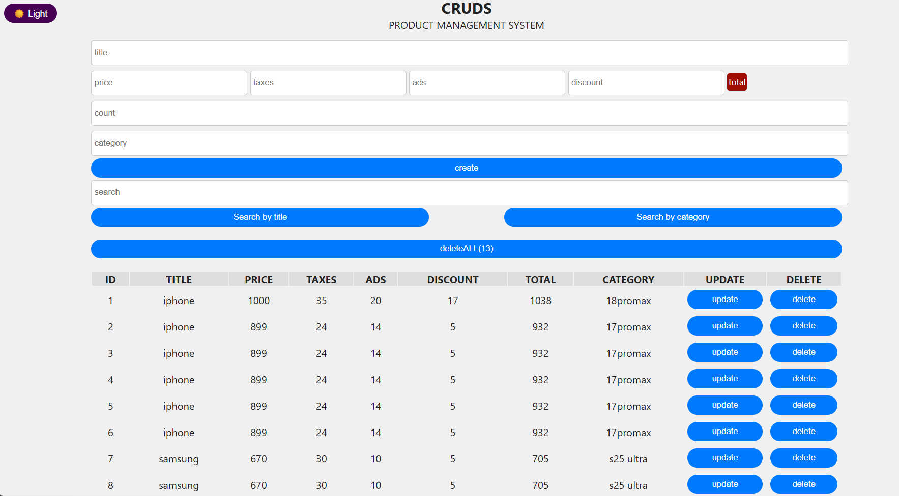

# 🛒 CRUDS - Product Management System


A fully-featured, responsive **Product Management System** built entirely with **Vanilla JavaScript** — **No frameworks, no libraries, no dependencies!** One of the largest and most feature-rich projects in my portfolio.

## ✨ Features

### 🔄 Core CRUD Operations
- ➕ **Create** — Add new products with full details (title, price, taxes, ads, discount, count, category)
- 📖 **Read** — View all products in a clean, organized table
- ✏️ **Update** — Edit any product directly from the table
- 🗑️ **Delete** — Delete individual products with a success toast
- 🧹 **Delete All** — Wipe all products at once with a single click

### 🔍 Advanced Search
- **Dual Search Modes** — Search by **title** or **category**
- **Real-time Filtering** — Results update as you type
- **Case-insensitive** — Works regardless of letter casing

### 💰 Smart Price Calculation
- **Auto-calculated Total** — Automatically computes `(Price + Taxes + Ads) - Discount`
- **Live Updates** — Total recalculates on every keystroke
- **Visual Feedback** — Total badge changes color based on validity

### 🔢 Batch Creation
- **Add Multiple Copies** — Create several identical products at once
- **Flexible Input** — Set any count value

### 💾 Data Persistence
- **LocalStorage Integration** — All data persists after page reload
- **No Backend Required** — Works completely offline

### 🎨 User Interface
- **Dark / Light Mode** — Toggle themes with preference saved in LocalStorage
- **Toast Notifications** — Real-time feedback for every action (success/error)
- **Fully Responsive** — Mobile-friendly design with horizontal scroll for tables
- **Scroll-to-Top Button** — Smooth navigation for long lists
- **Modern Styling** — Gradient buttons, hover effects, and smooth transitions

## 🛠️ Tech Stack

| Technology | Purpose |
| :--- | :--- |
| **HTML5** | Semantic page structure |
| **CSS3** | Modern styling (Flexbox, Grid, Gradients, Media Queries) |
| **JavaScript (Vanilla)** | Logic, DOM manipulation, Event Handling |
| **LocalStorage API** | Persistent client-side data storage |

## 💡 Why Vanilla JavaScript?

This project is built **100% with Vanilla JavaScript** — no React, no Vue, no jQuery, and no external libraries.

### Why?
- 🎯 **Deep Understanding** — Mastering the fundamentals of JavaScript
- ⚡ **Lightweight** — Zero dependencies means faster load times
- 🔧 **Full Control** — Every line of code is intentional
- 📚 **Learning by Doing** — Building everything from scratch

This proves that **you don't need a framework to build a powerful web application.**

## 🚀 How to Run

1. Clone the repository:
   ```bash
   git clone https://github.com/ali-alfozo/CRUDS-Project.git
   ```
2. Open `index.html` in your browser.

## 🌐 Live Demo

Experience the application directly in your browser:

🔗 https://ali-alfozo.github.io/CRUDS-Project/

## 📚 What I Learned

Through building this project from scratch, I strengthened my understanding of:

- 🎯 **DOM Manipulation** — Dynamically creating, updating, and removing elements
- 🖱️ **Event Handling** — Managing user interactions through various events
- 💾 **LocalStorage API** — Storing and retrieving persistent data
- 🔄 **CRUD Logic** — Implementing Create, Read, Update, and Delete operations
- 🔍 **Search & Filtering** — Building real-time search functionality
- 📱 **Responsive Design** — Creating layouts that adapt to different screen sizes
- 🌙 **Theme Management** — Implementing Dark/Light mode with saved preferences
- ⚡ **Dynamic UI Updates** — Updating the interface without page reloads
- 🧩 **Application Structure** — Organizing JavaScript code for maintainability

## 📸 Screenshots

### 🌙 Dark Mode


### ☀️ Light Mode


## 👨‍💻 Author

**Ali Alfozo**
 
- GitHub: [@ali-alfozo](https://github.com/ali-alfozo)


